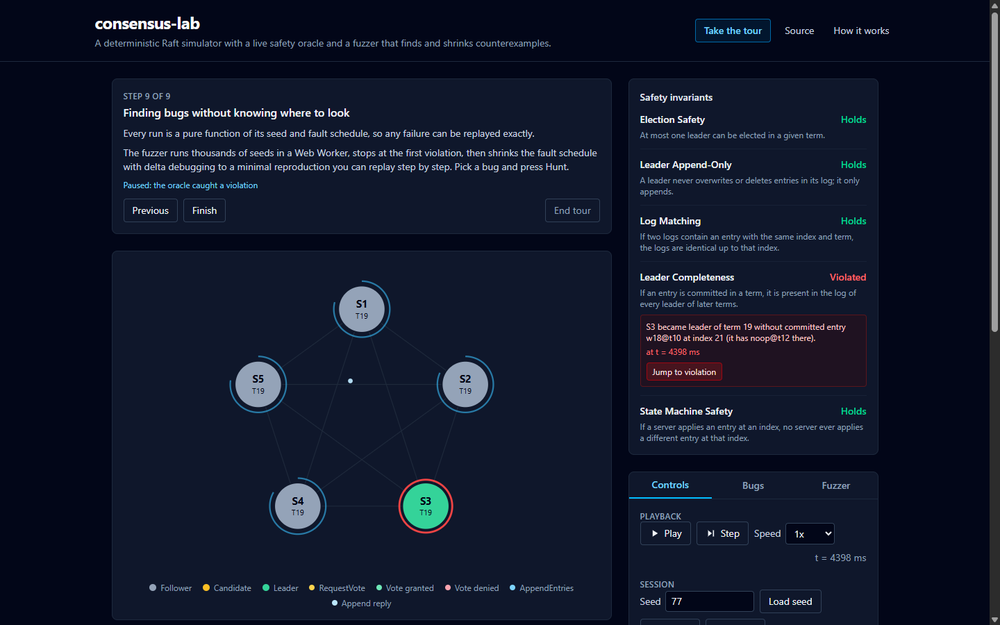
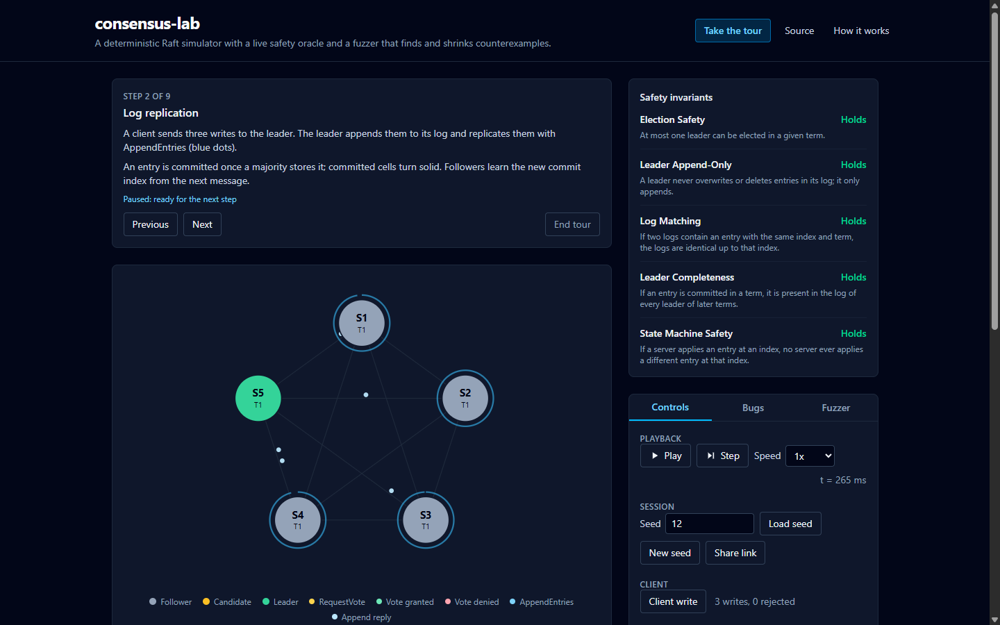

# consensus-lab

A deterministic simulator of the [Raft](https://raft.github.io/) consensus algorithm that runs in the browser. It shows a five-node cluster electing leaders and replicating a log while you crash servers and cut the network. An oracle checks Raft's safety properties after every event. You can switch on one of three classic implementation bugs and watch a seeded fuzzer find it, shrink the failing run and replay it step by step.

**Live demo: https://faizkhairi.github.io/consensus-lab/**





## What you can do

- **Watch Raft work.** Messages move between servers. Each server shows its election timer, and every log entry is coloured by its term. The guided tour covers election, replication, a leader crash, a network partition and the heal.
- **Break things.** Crash and restart servers, isolate the leader, partition the cluster, raise message loss and send client writes.
- **Inject a bug.** Three well-known Raft mistakes, each behind one flag:
  - committing entries from earlier terms (the Figure 8 scenario);
  - forgetting `votedFor` on restart;
  - granting votes without the up-to-date check.
- **See the oracle catch it.** The five properties from Figure 3 of the Raft paper are checked after every event. When one breaks, the run pauses at the exact event.
- **Hunt with the fuzzer.** A Web Worker runs thousands of seeded runs with random faults. When one fails, delta debugging shrinks the fault schedule, often down to one or two faults, and you can replay the result.
- **Travel in time and share.** Every run is deterministic, so you can scrub the timeline back and forth. A share link reproduces the exact run on another machine.

## How it works

The whole cluster runs in a discrete-event simulation with virtual time and seeded randomness. The network, the timers and the faults each draw from their own random stream. A run is a pure function of its seed, configuration and fault schedule, and three things follow from that:

- a failing seed reproduces exactly, every time;
- time travel is re-simulation from zero, which takes milliseconds;
- the shrinker can remove faults and replay the run to see whether it still fails.

The same idea underpins deterministic simulation testing at FoundationDB and TigerBeetle. [docs/DESIGN.md](docs/DESIGN.md) covers the simulator, the oracle, the bugs, the fuzzer and the shrinker in detail.

## Results

Measured over consecutive seeds, with 6 seconds of simulated time and a random fault schedule per seed:

| Mode | Runs with a safety violation | Minimal counterexample found |
|---|---|---|
| Correct Raft | 0 of 20,000 | n/a |
| Commit entries from earlier terms | 15 of 10,000 | 6 faults (from 31) |
| Forget `votedFor` on restart | 40 of 10,000 | 1 fault (from 83) |
| Skip the up-to-date check | 9,019 of 10,000 | 1 fault (from 58) |

The simulator processes about 4 million events per second on one laptop core. CI fuzzes 20,000 seeds of correct Raft on every push.

## Running locally

Requires Node 24.

```sh
npm ci
npm run dev          # http://localhost:5173/consensus-lab/
```

| Command | What it does |
|---|---|
| `npm test` | unit, scenario and property tests |
| `npm run test:coverage` | the same, with the coverage floor on `src/sim` |
| `npm run fuzz` | deep fuzz (`FUZZ_SEEDS=20000 npm run fuzz` for more seeds) |
| `npm run e2e` | Playwright end-to-end and accessibility tests against a production build |
| `npm run check` | Biome lint and format, plus the repository's punctuation check |
| `npm run typecheck` | TypeScript |

## Layout

```
src/sim/      the simulator: Raft node, scheduler, network, oracle, nemesis, fuzzer (no DOM)
src/worker/   the fuzzer's Web Worker
src/ui/       React UI and the controller that drives the simulation
tests/        Vitest unit, scenario, property and fuzz tests
e2e/          Playwright tests
docs/         design notes
```

## Testing

- Each safety check has a positive control: a hand-built bad state that the check must report.
- Property tests (fast-check) generate random fault schedules and assert that safety holds, that runs are deterministic, and that the cluster recovers once faults stop.
- Pinned counterexamples must fail with their bug switched on and pass with it off.
- Playwright tests the built site: the election on load, share-link replay, the tour, and fuzz-then-replay. They fail on any console error and run an axe accessibility scan.

The site deploys only after every check passes.

## Roadmap

Out of scope today, and possible next steps:

- cluster membership changes (joint consensus);
- log compaction and snapshots;
- PreVote and CheckQuorum;
- linearizable reads and client sessions.

## References

- Diego Ongaro and John Ousterhout, [In Search of an Understandable Consensus Algorithm](https://raft.github.io/raft.pdf) (2014)
- Will Wilson, [Testing Distributed Systems w/ Deterministic Simulation](https://www.youtube.com/watch?v=4fFDFbi3toc) (FoundationDB, Strange Loop 2014)
- [TigerBeetle's VOPR](https://github.com/tigerbeetle/tigerbeetle/blob/main/docs/internals/vopr.md)
- [Jepsen](https://jepsen.io/)
- Andreas Zeller and Ralf Hildebrandt, Simplifying and Isolating Failure-Inducing Input (IEEE TSE, 2002)

## License

[MIT](LICENSE)
